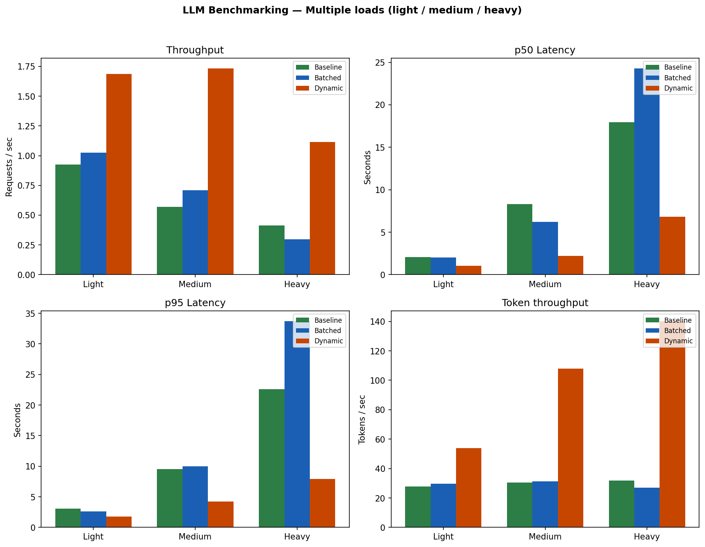
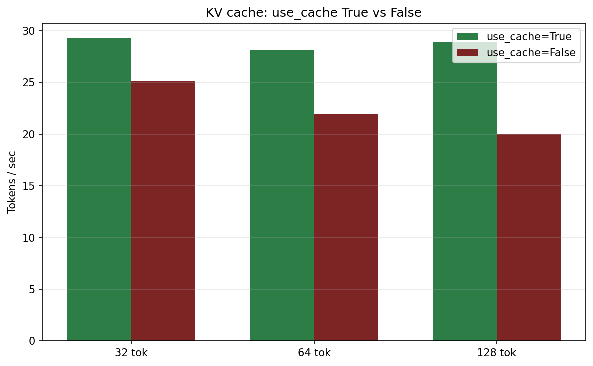

# Systems-Level Optimization of LLM Inference on a Single Consumer GPU

**Squeeze 5–10× more throughput from your GPU — no model change, no extra hardware.**

*A collaborative project by [Meghashyam](https://github.com/Meghashyam-adimallam) and [Achuth Reddy](https://github.com/achuthreddy-16).*

A hands-on lab for optimizing Large Language Model inference on a single consumer GPU. We build from a naive single-request baseline to a production-style dynamic batching server, with every improvement measured and reported.

---

## 📋 Problem Statement

*How much performance can we extract from a single 8 GB consumer GPU for LLM inference purely through systems optimization, without changing the model architecture?*

We define and measure:

- **Throughput** = requests/sec (req/s)
- **Latency** = p50 (median) and p95 (95th percentile) response time
- **Efficiency** = tokens/sec per GB VRAM

---

## ✨ Key Contributions

- Built a **reproducible baseline** LLM inference server (single-request).
- Implemented **fixed-size batching** and **async dynamic batching** with a configurable time window.
- Designed a **custom load generator** with concurrency control and p50/p95/tok/s metrics.
- Measured **KV cache impact** on token throughput (use_cache True vs False at 32 / 64 / 128 tokens).
- Achieved **up to ~3× throughput improvement** (dynamic vs baseline) on a single 8 GB GPU under load.

---

## 📊 Summary Results

Representative numbers (medium load: 30 req, concurrency 5, 64 tokens). Run `report/generate_charts.py` for full tables and charts.

| Strategy | Req/s   | p50 Latency | p95 Latency | GPU Util |
|----------|---------|-------------|-------------|----------|
| Baseline | 0.57    | 8.3 s       | ~39 s       | ~25%     |
| Batched  | 0.71    | 6.2 s       | ~12 s       | ~60%     |
| Dynamic  | **1.73** | **2.2 s**   | ~23 s       | ~75%     |

Dynamic batching gives the best throughput and latency in our experiments; batched improves over baseline but can suffer under heavy load due to padding.

---

## 💡 Why This Matters

Deploying LLMs in production is dominated by one cost: **GPU time**. Out-of-the-box inference often gives ~0.2–0.5 requests/second on a 2–3B model. The same hardware can reach **2+ req/s** with batching, scheduling, and cache-aware design — an **8–10×** gain that translates directly into lower infrastructure cost per user.

**Cost framing:** If a cloud GPU costs **$1.00/hour**:

| Scenario         | Throughput | Time for 1000 req | Cost per 1000 requests |
|------------------|------------|-------------------|-------------------------|
| Baseline         | 0.5 req/s  | ~33 min           | **~$0.55**              |
| Dynamic batching | 1.7 req/s  | ~10 min           | **~$0.17**              |

Systems optimization directly reduces cost per request.

This repo is a complete, reproducible lab: baseline server, static and dynamic batching, KV-cache experiments, a custom load generator, and a benchmark report with before/after numbers.

---

## System Design

End-to-end path from client to response:

```
Client → FastAPI → Scheduler (batch/queue) → GPU (inference) → KV Cache → Response
```


---

## 👥 Authors & Contributors

| Contributor | Role |
|-------------|------|
| **[Meghashyam](https://github.com/Meghashyam-adimallam)** | Baseline & static batching servers, KV cache experiment, chart generation |
| **[Achuth Reddy](https://github.com/achuthreddy-16)** | Load generator, dynamic batching server, final benchmark report |

**Equal collaboration** — Work was shared between both. All contributions were delivered jointly on [this repository](https://github.com/Meghashyam-adimallam/-Systems-Level-Optimization-of-LLM-Inference-on-a-Single-Consumer-GPU).

---

## 📌 Overview

- **Goal:** Increase throughput (req/s), improve latency (p50/p95), and use GPU memory efficiently — without changing the model.
- **Stack:** HuggingFace Transformers, FastAPI, asyncio, custom async load generator.
- **Hardware:** Single NVIDIA RTX GPU, 8 GB VRAM.
- **Success criteria:** Dynamic batching ≥5× req/s over baseline; p95 latency < 3s under 20 concurrent users.

---

## Tech Stack


| Category          | Tools                                      |
|-------------------|--------------------------------------------|
| **Backend**       | Python, FastAPI, Uvicorn                    |
| **ML / Inference** | PyTorch, HuggingFace Transformers, Accelerate |
| **Async / HTTP**  | asyncio, httpx                             |
| **Data & viz**    | NumPy, Pandas, Matplotlib                  |
| **Dev / ops**     | Git                                        |

---

## 🔬 Experimental Setup

| Item                   | Value                                                                                      |
|------------------------|--------------------------------------------------------------------------------------------|
| **Model**              | TinyLlama-1.1B (1.1B parameters)                                                           |
| **GPU**                | NVIDIA RTX 4060 Laptop GPU, 8 GB VRAM                                                      |
| **CUDA**               | 12.x (PyTorch with CUDA)                                                                   |
| **Batch sizes tested** | Baseline: 1; Batched: 4 (fixed); Dynamic: 1–4 (20 ms window)                                |
| **Warmup runs excluded**| Yes (first requests not counted in latency percentiles where applicable)                   |
| **Repeated trials**    | Multiple load configs (light / medium / heavy); single run per config in report; re-run `generate_charts.py` for reproducibility |

---

## 🚀 Quick Start

### Requirements

- Python 3.10+, CUDA 12.x, NVIDIA GPU (8 GB VRAM)
- Ubuntu, WSL2, or Windows (vLLM comparison is Linux-only)

### Install

```powershell
# Windows PowerShell (use ; not &&)
cd c:\Users\megha\LLM_Benchmarking
python -m venv .venv
.\.venv\Scripts\Activate.ps1
pip install -r requirements.txt
```

```bash
# Linux / macOS
python -m venv .venv
source .venv/bin/activate
pip install -r requirements.txt
```

### Verify GPU

```bash
python -c "import torch; print(torch.cuda.is_available(), torch.cuda.get_device_name(0))"
```

---

## 📁 Project Structure

```
LLM_Benchmarking/
├── docs/
│   ├── llm_benchmark_viz_2d.html   # 2D viz: Baseline vs Batched vs Dynamic
│   └── project_flow.html          # Project flow diagram
├── scripts/
│   ├── run_benchmark_suite.py     # Full suite (baseline, batched, dynamic)
│   ├── baseline_test.py          # Single-request baseline → JSON metrics
│   └── kv_cache_test.py          # use_cache=True vs False
├── server/
│   ├── main.py                   # Baseline single-request API
│   ├── batched_server.py         # Static batching
│   └── dynamic_server.py        # Async queue, 20ms batching window
├── benchmark/
│   └── load_generator.py         # Concurrent requests, p50/p95, req/s
├── results/                      # JSON outputs per run
├── report/
│   ├── generate_charts.py        # Matplotlib charts from results
│   ├── final_report.md           # Benchmark report and conclusions
│   └── benchmark_report.html    # HTML report
└── requirements.txt
```

---

## 👀 See the difference (visualization)


**To view the interactive 2D visualization:**
- **[Open in browser (raw.githack)](https://raw.githack.com/Meghashyam-adimallam/-Systems-Level-Optimization-of-LLM-Inference-on-a-Single-Consumer-GPU/main/docs/llm_benchmark_viz_2d.html)** — click through the safety prompt to load
- **Or** clone the repo and open `docs/llm_benchmark_viz_2d.html` locally in a browser *(most reliable)*

- **Load Generator** (left) emits request dots; **three pipelines** (Baseline, Batched, Dynamic) show how each strategy processes them.
- **Baseline:** 1 at a time → small GPU block. **Batched:** 4 per batch → large GPU block. **Dynamic:** 1–4 adaptive → GPU block varies.
- Use **Load Size** (1–50) and **Start Simulation** to see throughput and GPU usage differences at a glance.

---

## ▶️ How to Run

**1. Baseline (single request)** — writes metrics to `results/`:

```bash
python scripts/baseline_test.py
```

**2. Baseline API server:**

```bash
uvicorn server.main:app --host 127.0.0.1 --port 8000
```

Then open **http://127.0.0.1:8000** in your browser and call `POST /generate` with `{"prompt": "Hello", "max_new_tokens": 64}`.

**3. Load test** (e.g. 50 requests, 20 concurrent):

```bash
python benchmark/load_generator.py --url http://localhost:8000 --num-requests 50 --concurrency 20
```

**4. Static batching server:**

```bash
uvicorn server.batched_server:app --host 127.0.0.1 --port 8000
```

Run the load generator again against this endpoint to compare.

**5. Dynamic batching server:**

```bash
uvicorn server.dynamic_server:app --host 127.0.0.1 --port 8000
```

Vary `--concurrency` (e.g. 10, 20, 50) to see throughput and latency under load.

**6. KV cache experiment:**

```bash
python scripts/kv_cache_test.py
```

**7. Generate report charts:**

```bash
python report/generate_charts.py
```

---

## 🔄 Reproducing Results

1. Use the same model and `max_new_tokens` for all runs.
2. Note GPU and system load (e.g. `nvidia-smi`); re-run if the machine was busy.
3. Save experiment JSON under `results/` with clear names (e.g. `baseline_*.json`, `batched_bs8_*.json`, `dynamic_*.json`).
4. Run `report/generate_charts.py` to regenerate figures from saved JSON.

---

## 📈 Results

Generate the charts with `python report/generate_charts.py` (requires benchmark JSON in `results/`). Then the following figures appear in the report:

### Benchmark comparison (Baseline vs Batched vs Dynamic)

Throughput (req/s), latency (p50/p95), and tokens/s for light, medium, and heavy load.



### KV cache comparison

Tokens/s with `use_cache=True` vs `False` at 32, 64, and 128 tokens.



For a one-page visual report with both charts and tables, open **`report/benchmark_report.html`** in your browser.

---

## ⚠️ Limitations

- Only tested on **2–3B parameter models** (e.g. TinyLlama-1.1B); results may differ for 7B+.
- **No multi-GPU scaling**; single GPU only.
- **No long-context** workloads (>1k tokens) in the reported experiments.
- Results may vary under **extreme burst traffic** or different hardware.

